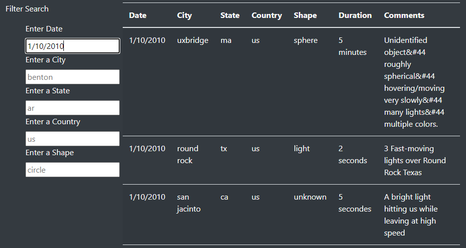
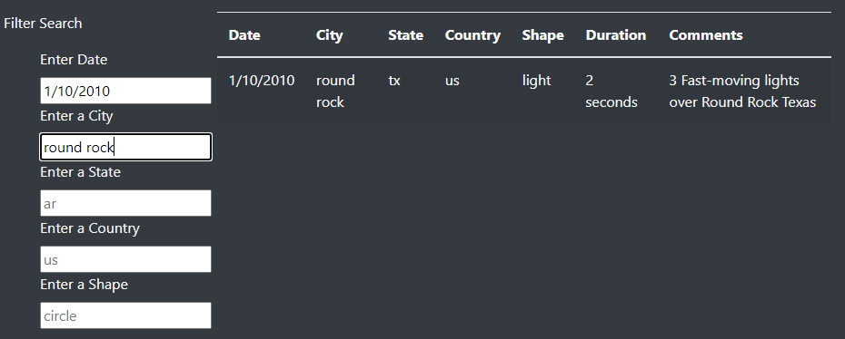
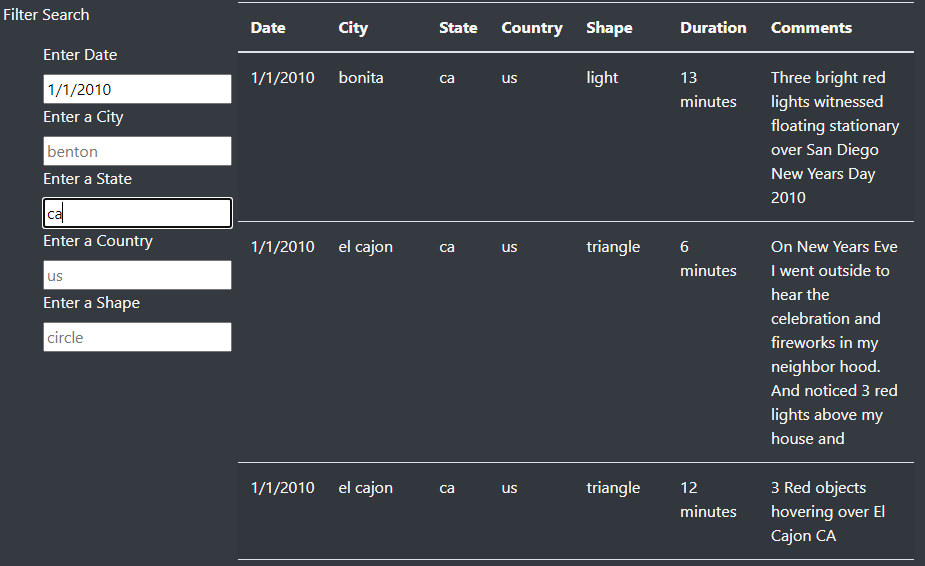

# UFOs
 
# Overview

The purpose of this analysis is to identify UFO sightings based on a number of search criteria. The data can be filtered by date, city, state, country and shape.

# Results

The data is now easily searchable by using JavaScript. Here is how one might use it:

## Filter example:

Enter a date into the date field and press enter.

You can further filter by entering a city

If you want to broaden the search and only view by state, clear all other fields and only enter a state as below:

